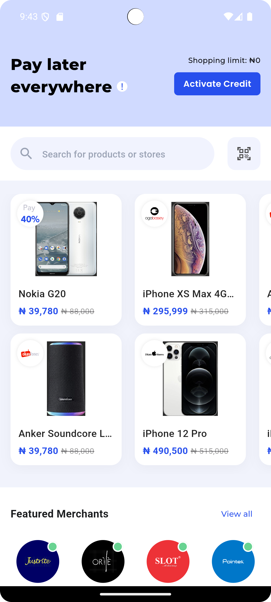
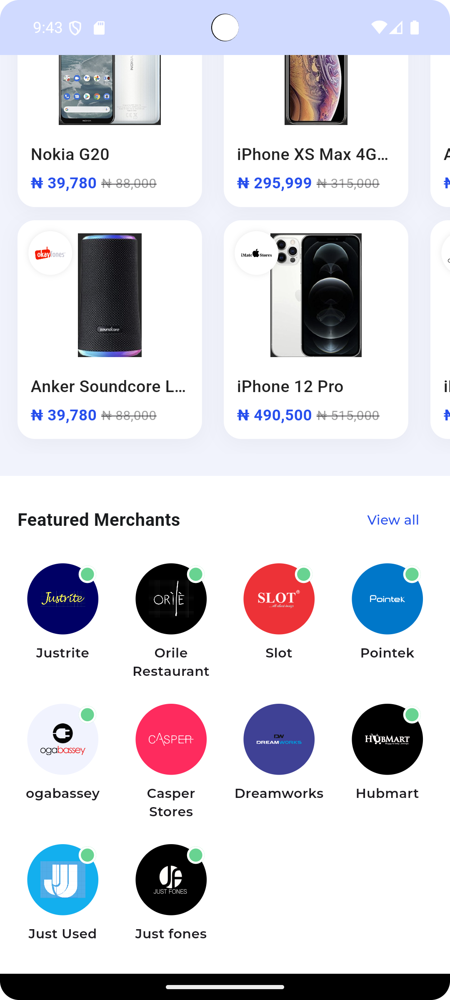

# CredPal Shopping UI Clone


A high-fidelity **Flutter UI clone** of the CredPal shopping interface, featuring a horizontal
product grid with peek effects, a merchant directory, and custom search components.

---

## Screenshots

<p float="left">
  
  
</p>

<sub>Available Products · Featured Merchants · Search Component</sub>

---

## Prerequisites

- **Flutter SDK:** `>=3.4.3 <4.0.0`
- **Dart:** 3.4.3(stable)

---

## Features

- **Custom Search Bar**  
  Search input with a modular scan action button.

- **Horizontal Product Grid (Peek Effect)**  
   Nudges users of more products features  
  `RenderFlex` and overflow issues.

- **Merchant Directory**  
  Responsive brand grid with custom *online status* indicators and brand-specific color themes.

- **Adaptive Layouts**  
  Explicit constraint management to ensure smooth rendering across various screen sizes.

---

## Project Structure

The project follows a standard Flutter layout:

```text
assets/
 ├── images/        # Product images and brand logos
 └── screenshots/   # README documentation images

lib/
 ├── data/          # Models (Product, Merchant) + mock data
 └── ui/
     ├── screen/    # Dashboard screen
     └── widgets/   # CustomSearchBar, ProductGridItem, MerchantItem
